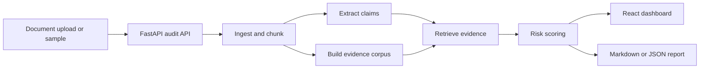
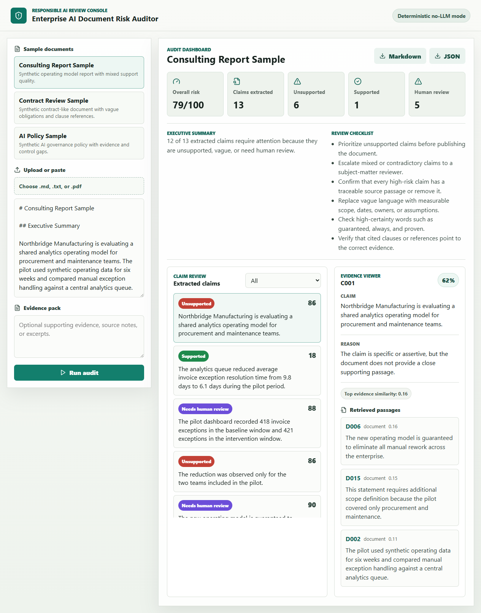

# Enterprise AI Document Risk Auditor

Local demo app for auditing business documents for unsupported claims, vague language, missing evidence, and document-grounding risk.

This project is built as a responsible-AI and consulting-tech portfolio repo. It demonstrates a practical workflow for reviewing AI-generated or analyst-written business documents before they are shared with decision makers.

## What It Does

- Extracts factual-looking claims from a business document.
- Retrieves supporting passages from the same document or an optional evidence pack.
- Classifies each claim as `Supported`, `Weakly supported`, `Unsupported`, `Vague / non-verifiable`, or `Needs human review`.
- Produces a risk score, explanation, evidence snippets, executive summary, and review checklist.
- Exports the audit as Markdown or JSON.
- Runs locally without paid API keys.

## Why It Matters

Enterprise AI systems increasingly draft policies, reports, contracts, and recommendations. The risk is not just whether the text sounds fluent. The risk is whether important claims are grounded in evidence, scoped correctly, and safe for a human reviewer to approve.

This repo shows a simple but realistic pattern: deterministic claim extraction, local retrieval, transparent risk scoring, and a human-review dashboard.

## Architecture



## Screenshots

The dashboard is generated locally from synthetic samples.



## Repository Structure

```text
enterprise-ai-document-risk-auditor/
  backend/              FastAPI API and deterministic audit pipeline
  frontend/             React/Vite dashboard
  data/samples/         Synthetic sample documents
  docs/                 Architecture, methodology, and dataset notes
  .env.example          Optional LLM/local endpoint configuration
  docker-compose.yml    Optional containerized local run path
```

## Local Setup

From the repository root:

```powershell
python -m venv .venv
.\.venv\Scripts\Activate.ps1
pip install -r backend\requirements.txt
```

PowerShell may block `npm.ps1` on Windows. Use `npm.cmd`:

```powershell
cd frontend
npm.cmd install
```

## Run The App

Terminal 1:

```powershell
cd "C:\Users\giwrg\OneDrive - TU Eindhoven\Επιφάνεια εργασίας\TUe\github-portfolio\enterprise-ai-document-risk-auditor"
.\.venv\Scripts\Activate.ps1
python -m uvicorn backend.app.main:app --reload --port 8010
```

Terminal 2:

```powershell
cd "C:\Users\giwrg\OneDrive - TU Eindhoven\Επιφάνεια εργασίας\TUe\github-portfolio\enterprise-ai-document-risk-auditor\frontend"
npm.cmd run dev
```

Open:

```text
http://127.0.0.1:5173
```

## Run Tests

Backend:

```powershell
.\.venv\Scripts\Activate.ps1
pytest backend\tests
```

Frontend:

```powershell
cd frontend
npm.cmd test
npm.cmd run build
```

## API Summary

- `GET /health`: service health check.
- `GET /samples`: list included synthetic samples.
- `GET /samples/{sample_id}`: load a sample document.
- `POST /audit`: audit pasted text or uploaded `.md`, `.txt`, or `.pdf` content.
- `POST /export`: export an audit result as Markdown or JSON.

## Optional LLM Modes

The default mode is deterministic and does not call an LLM.

For LM Studio or another OpenAI-compatible local endpoint:

```env
LLM_MODE=openai_compatible
OPENAI_BASE_URL=http://127.0.0.1:1234/v1
OPENAI_API_KEY=lm-studio
OPENAI_MODEL=local-model
```

For hosted OpenAI-compatible use, set `LLM_MODE=openai` and provide your own key in a local `.env` file. Do not commit real keys.

## Sample Workflow

1. Start the backend and frontend.
2. Select `Consulting Report Sample`.
3. Run the audit.
4. Filter for `Unsupported` or `Needs human review`.
5. Inspect the retrieved evidence snippets.
6. Export the Markdown report.

## Data Notes

The included documents are synthetic. They are safe to publish and do not contain client data, private coursework, credentials, or personal information.

Relevant public datasets for future experiments include FEVER, CUAD, and QASPER. They are not downloaded by default, and large datasets should not be committed.

## Limitations

- The deterministic scorer is transparent but not a truth engine.
- It can miss implicit support, table-only evidence, and domain-specific nuance.
- PDF extraction depends on embedded text quality.
- The optional LLM adapter is intentionally not required for the core workflow.

## Future Work

- Add optional sentence-transformer embeddings for stronger retrieval.
- Add side-by-side source highlighting.
- Add structured evidence packs with citation IDs.
- Add reviewer annotations and saved audit sessions.
- Add small opt-in dataset preparation scripts for FEVER, CUAD, and QASPER.

## Private Data Warning

Do not commit real client documents, private datasets, university-restricted material, assignment PDFs, credentials, local OneDrive paths, or API keys.
