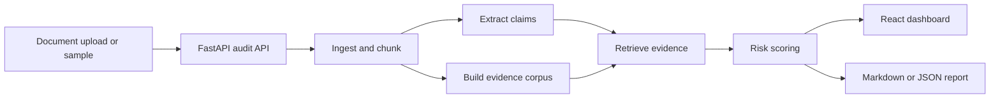

# Enterprise AI Document Risk Auditor

Local demo app for auditing business documents for unsupported claims, vague language, missing evidence, and document-grounding risk.

This project is built as a responsible-AI and consulting-tech portfolio repo. It demonstrates a practical workflow for reviewing AI-generated or analyst-written business documents before they are shared with decision makers.

## What It Does

- Extracts factual-looking claims from a business document.
- Retrieves supporting passages from the same document or an optional evidence pack.
- Classifies each claim as `Supported`, `Weakly supported`, `Unsupported`, `Vague / non-verifiable`, or `Needs human review`.
- Produces a risk score, explanation, evidence snippets, executive summary, and review checklist.
- Exports the audit as Markdown or JSON.
- Runs locally without paid API keys.

## Why It Matters

Enterprise AI systems increasingly draft policies, reports, contracts, and recommendations. The risk is not just whether the text sounds fluent. The risk is whether important claims are grounded in evidence, scoped correctly, and safe for a human reviewer to approve.

This repo shows a simple but realistic pattern: deterministic claim extraction, local retrieval, transparent risk scoring, and a human-review dashboard.

## Architecture



## Screenshot

The dashboard is generated locally from synthetic samples.


## Repository Structure

```text
enterprise-ai-document-risk-auditor/
  backend/              FastAPI API and deterministic audit pipeline
  frontend/             React/Vite dashboard
  data/samples/         Synthetic sample documents
  data/eval/            Ignored local evaluation outputs
  scripts/              Optional FEVER/CUAD preparation and evaluation scripts
  tests/                Dataset evaluation smoke tests
  docs/                 Architecture, methodology, and dataset notes
  AGENTS.md             Agent handoff notes for future development
  .env.example          Optional LLM/local endpoint configuration
  docker-compose.yml    Optional containerized local run path
```

## Local Setup

From the repository root:

```powershell
python -m venv .venv
.\.venv\Scripts\Activate.ps1
pip install -r backend\requirements.txt
```

PowerShell may block `npm.ps1` on Windows. Use `npm.cmd`:

```powershell
cd frontend
npm.cmd install
```

## Run The App

Terminal 1:

```powershell
cd enterprise-ai-document-risk-auditor
.\.venv\Scripts\Activate.ps1
python -m uvicorn backend.app.main:app --reload --port 8010
```

Terminal 2:

```powershell
cd enterprise-ai-document-risk-auditor\frontend
npm.cmd run dev
```

Open:

```text
http://127.0.0.1:5173
```

## Run Tests

Backend:

```powershell
.\.venv\Scripts\Activate.ps1
pytest backend\tests
```

All Python tests, including dataset smoke tests:

```powershell
.\.venv\Scripts\Activate.ps1
pytest
```

Frontend:

```powershell
cd frontend
npm.cmd test
npm.cmd run build
```

## API Summary

- `GET /health`: service health check.
- `GET /samples`: list included synthetic samples.
- `GET /samples/{sample_id}`: load a sample document.
- `POST /audit`: audit pasted text or uploaded `.md`, `.txt`, or `.pdf` content.
- `POST /export`: export an audit result as Markdown or JSON.

## Optional LLM Modes

The default mode is deterministic and does not call an LLM. The implemented non-deterministic path is an optional Gemini reviewer that runs after the deterministic audit and adds reviewer notes.

To test Gemini with your student key:

```powershell
Copy-Item .env.example .env
notepad .env
```

Then change:

```env
LLM_MODE=gemini
GEMINI_API_KEY=replace-with-your-gemini-api-key
GEMINI_MODEL=gemini-2.5-flash-lite
```

Replace `replace-with-your-gemini-api-key` with your real key and restart the backend.

The backend uses Google's REST `generateContent` endpoint with the `x-goog-api-key` header. The deterministic audit still runs if Gemini fails or hits a rate limit.

Future OpenAI-compatible settings are present in `.env.example`, but Gemini is the implemented optional LLM path in this version.

For reference, the local LLM placeholders are:

```env
OPENAI_BASE_URL=http://127.0.0.1:1234/v1
OPENAI_API_KEY=lm-studio
OPENAI_MODEL=local-model
```

## Sample Workflow

1. Start the backend and frontend.
2. Select `Consulting Report Sample`.
3. Run the audit.
4. Filter for `Unsupported` or `Needs human review`.
5. Inspect the retrieved evidence snippets.
6. Export the Markdown report.

## Data Notes

The included documents are synthetic. They are safe to publish and do not contain client data, private coursework, credentials, or personal information.

The default UI demo uses `data/samples/consulting_report_sample.md`. Optional dataset scripts are provided for small local evaluation subsets only. They do not download large datasets automatically, and generated files under `data/eval/` are ignored.

## Optional Dataset Evaluation

Relevant public datasets:

- [FEVER](https://fever.ai/dataset/fever.html): claim verification data with `SUPPORTS`, `REFUTES`, and `NOT ENOUGH INFO` labels.
- [FEVER paper](https://arxiv.org/abs/1803.05355): background on fact extraction and verification.
- [CUAD](https://www.atticusprojectai.org/cuad/): contract review dataset from The Atticus Project.
- [CUAD Zenodo record](https://zenodo.org/records/4595826): archived CUAD v1 dataset package.
- [CUAD paper](https://arxiv.org/abs/2103.06268): background on expert-annotated legal contract review.

Detailed download commands are in [docs/download_datasets.md](docs/download_datasets.md).

Rendered example outputs from a tiny Gemini-backed run are in [docs/evaluation_results](docs/evaluation_results/README.md).

What each dataset tests:

- FEVER tests whether the auditor assigns lower risk to supported claims than to refuted or not-enough-info claims. This is a lightweight risk-scoring check, not a replacement for a full FEVER retrieval benchmark.
- CUAD tests long-form contract ingestion, vague-clause detection, risk triage, and evidence snippet display. CUAD is used here as a contract-review stress test, not a hallucination benchmark.
- The synthetic consulting report remains the default UI demo because it is small, safe to publish, and immediately runnable.

Prepare a small FEVER subset from a local FEVER JSONL file:

```powershell
python scripts\prepare_fever_subset.py `
  --input data\raw\fever\paper_dev.jsonl `
  --output data\eval\fever_subset.jsonl `
  --max-per-label 5
```

If you have a small local FEVER Wikipedia-pages folder and want to resolve evidence sentence text:

```powershell
python scripts\prepare_fever_subset.py `
  --input data\raw\fever\paper_dev.jsonl `
  --wiki-pages-dir data\raw\fever\wiki-pages `
  --output data\eval\fever_subset.jsonl `
  --max-per-label 5
```

Evaluate relative risk separation:

```powershell
python scripts\evaluate_fever_risk.py `
  --input data\eval\fever_subset.jsonl `
  --output data\eval\fever_eval_summary.json
```

Prepare and audit a small CUAD contract subset from local `.txt`, `.md`, or JSON files:

```powershell
python scripts\prepare_cuad_subset.py `
  --input data\raw\cuad\sample_contracts `
  --output data\eval\cuad_subset.jsonl `
  --summary-output data\eval\cuad_audit_summary.json `
  --max-docs 3
```

The scripts print JSON summaries to the terminal and write generated outputs under `data/eval/`.

## Limitations

- The deterministic scorer is transparent but not a truth engine.
- It can miss implicit support, table-only evidence, and domain-specific nuance.
- PDF extraction depends on embedded text quality.
- The optional LLM adapter is intentionally not required for the core workflow.
- FEVER support checks depend on available evidence text. If only FEVER evidence references are available, the preparation script creates a clearly marked label-aware fallback evidence pack for small calibration tests.
- CUAD annotations are designed for legal clause extraction and review. This project uses CUAD to stress-test contract ingestion and risk triage, not to measure hallucination detection accuracy.

## Future Work

- Add optional sentence-transformer embeddings for stronger retrieval.
- Add side-by-side source highlighting.
- Add structured evidence packs with citation IDs.
- Add reviewer annotations and saved audit sessions.
- Add QASPER preparation for evidence-grounded research-paper review.
- Add richer FEVER evidence resolution over a small local Wikipedia subset.

## Private Data Warning

Do not commit real client documents, private datasets, university-restricted material, assignment PDFs, credentials, local OneDrive paths, or API keys.
