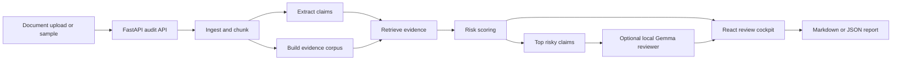
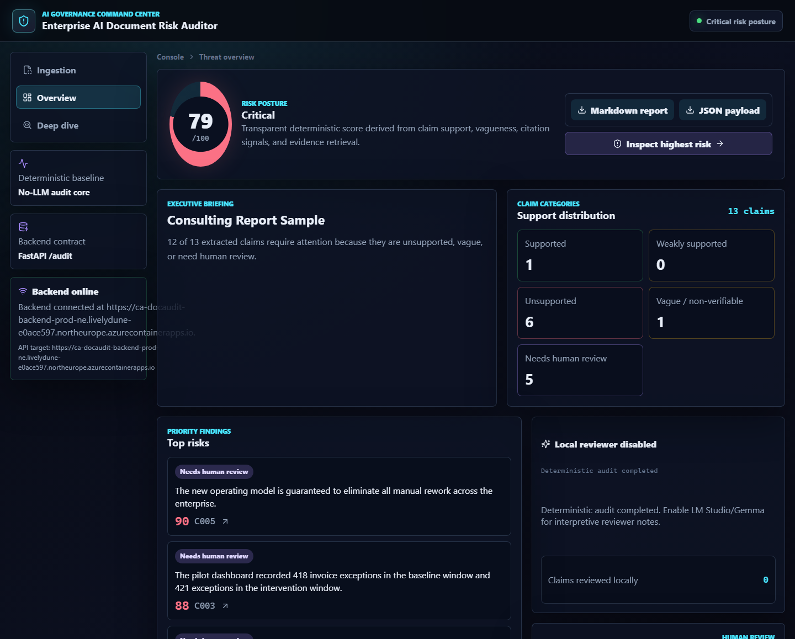

# Enterprise AI Document Risk Auditor

Local demo app for auditing business documents for unsupported claims, vague language, missing evidence, and document-grounding risk.

This project is built as a responsible-AI and consulting-tech portfolio repo. It demonstrates a practical workflow for reviewing AI-generated or analyst-written business documents before they are shared with decision makers.

## What It Does

- Extracts factual-looking claims from a business document.
- Retrieves supporting passages from the same document or an optional evidence pack.
- Classifies each claim as `Supported`, `Weakly supported`, `Unsupported`, `Vague / non-verifiable`, or `Needs human review`.
- Produces a risk score, explanation, evidence snippets, executive summary, and review checklist.
- Optionally adds structured local Gemma reviewer notes for the top risky claims through LM Studio.
- Exports the audit as Markdown or JSON.
- Runs locally without paid API keys.

## Why It Matters

Enterprise AI systems increasingly draft policies, reports, contracts, and recommendations. The risk is not just whether the text sounds fluent. The risk is whether important claims are grounded in evidence, scoped correctly, and safe for a human reviewer to approve.

This repo shows a simple but realistic pattern: deterministic claim extraction, local retrieval, transparent risk scoring, and a local LLM reviewer layer for human-review support.

## Portfolio Relevance

This project demonstrates responsible enterprise AI beyond a chatbot interface: document-grounded claim review, transparent risk scoring, optional local Gemma reviewer notes, and a human-review workflow that fits consulting, governance, and AI engineering contexts.

## Demo in 3 Minutes

```powershell
python -m venv .venv
.\.venv\Scripts\Activate.ps1
pip install -r backend\requirements.txt
python -m uvicorn backend.app.main:app --reload --port 8010
```

In a second terminal:

```powershell
cd frontend
npm.cmd install
npm.cmd run dev
```

Open `http://127.0.0.1:5173`, select the consulting report sample, and click `Run risk scan`.

## Architecture


```mermaid
flowchart LR
    A["Document upload or sample"] --> B["FastAPI audit API"]
    B --> C["Ingest and chunk"]
    C --> D["Extract claims"]
    C --> E["Build evidence corpus"]
    D --> F["Retrieve evidence"]
    E --> F
    F --> G["Risk scoring"]
    G --> H["Top risky claims"]
    H --> I["Optional local Gemma reviewer"]
    G --> J["React review cockpit"]
    I --> J
    J --> K["Markdown or JSON report"]
```

The deterministic pipeline is the auditable baseline: ingestion, chunking, claim extraction, TF-IDF retrieval, risk scoring, labels, and exports are reproducible and do not require an LLM. The local Gemma reviewer is an interpretive layer: it reviews the top risky claims after scoring and adds notes, safer rewrites, missing-evidence questions, and business impact. If LM Studio is unavailable, the deterministic audit still completes.

## Deployment (retired September 2026)

The public deployment was intentionally retired in September 2026 after the
infrastructure and recovery path had been demonstrated. The Terraform in
[`infra/`](infra) and the write-up of what was deployed stay in the repository.

The stack was a React frontend on Static Web Apps, a FastAPI backend on
Container Apps with a system-assigned managed identity, sample documents
uploaded to Blob Storage, and remote Terraform state. The deployment held no
application secrets: the container image was pulled anonymously from a public
GHCR package, shared keys were disabled on the samples storage account, and the
backend identity held exactly one container-scoped RBAC grant on that account.
The Static Web Apps deployment token existed as a sensitive Terraform output
that the application never read. The app served its samples from the container
image, not from Blob Storage. The recorded checks listed the grant and listed
the blobs with the operator's own login; nothing read a blob with the app's
identity. The separate Terraform-state account still has shared keys enabled.

> **The first request took ~20s.** The backend scaled to zero when idle, so the
> first request after a quiet period cold-started a container. Subsequent
> requests were under 300ms. That tradeoff is why it was designed to cost about €0/month at idle; see
> [the deployment architecture](docs/architecture-azure.md#the-cold-start-and-why-it-is-here)
> for why it was chosen.

Full topology, cost breakdown, security model, and the destroy/recreate
reproducibility proof: **[docs/architecture-azure.md](docs/architecture-azure.md)**

## Screenshot

The dark risk-intelligence dashboard, captured while the deployment was live. All documents shipped with the project are synthetic.



## Repository Structure

```text
enterprise-ai-document-risk-auditor/
  backend/              FastAPI API and deterministic audit pipeline
  frontend/             React/Vite dashboard
  data/samples/         Synthetic sample documents
  data/eval/            Ignored local evaluation outputs
  scripts/              Optional CUAD preparation and report-rendering scripts
  evals/                Retrieval benchmark (evals/retrieval) and its offline fixture
  tests/                Dataset evaluation smoke tests and retrieval benchmark tests
  docs/                 Architecture, methodology, and dataset notes
  AGENTS.md             Agent handoff notes for future development
  .env.example          Optional LLM/local endpoint configuration
  .github/workflows/    ci.yml: pytest on push to main and on pull requests
  docker-compose.yml    Optional containerized local run path
```

## Local Setup

From the repository root:

```powershell
python -m venv .venv
.\.venv\Scripts\Activate.ps1
pip install -r backend\requirements.txt
```

PowerShell may block `npm.ps1` on Windows. Use `npm.cmd`:

```powershell
cd frontend
npm.cmd install
```

## Run The App

Terminal 1:

```powershell
cd enterprise-ai-document-risk-auditor
.\.venv\Scripts\Activate.ps1
python -m uvicorn backend.app.main:app --reload --port 8010
```

Terminal 2:

```powershell
cd enterprise-ai-document-risk-auditor\frontend
npm.cmd run dev
```

Open:

```text
http://127.0.0.1:5173
```

## Run Tests

Backend:

```powershell
.\.venv\Scripts\Activate.ps1
pytest backend\tests
```

All Python tests, including dataset smoke tests:

```powershell
.\.venv\Scripts\Activate.ps1
pytest
```

Frontend:

```powershell
cd frontend
npm.cmd test
npm.cmd run build
npm.cmd run test:e2e
```

The E2E smoke test serves the production frontend bundle locally and mocks the API responses for UI routing stability. Backend behavior is covered by the Python API tests above.

The retrieval benchmark tests (`tests/test_retrieval_bench.py`) need numpy and are skipped when it is not installed, so `pip install -r backend/requirements.txt` alone still gives a passing `pytest`. Install `evals/requirements.txt` to run them.

## API Summary

- `GET /health`: service health check.
- `GET /samples`: list included synthetic samples.
- `GET /samples/{sample_id}`: load a sample document.
- `POST /audit`: audit pasted text or uploaded `.md`, `.txt`, or `.pdf` content.
- `POST /export`: export an audit result as Markdown or JSON.

## Local Gemma Reviewer Setup

The default mode is deterministic and does not call an LLM. For the strongest local demo, use LM Studio with an OpenAI-compatible endpoint. The reviewer runs after the deterministic audit and only adds structured notes to the top risky claims.

1. Start the LM Studio local server.
2. Load `google/gemma-4-e4b` or another chat model.
3. Copy `.env.example` to `.env`.
4. Set:

```env
LLM_MODE=openai_compatible
OPENAI_BASE_URL=http://127.0.0.1:1234/v1
OPENAI_API_KEY=lm-studio
OPENAI_MODEL=google/gemma-4-e4b
```

If LM Studio shows a different model id, replace `google/gemma-4-e4b` with that exact value. Restart the backend after changing `.env`.

The local reviewer is optional. It does not decide the score, label, or evidence retrieval, and the scan does not fail if LM Studio is closed.

## Other Optional LLM Modes

Gemini is still supported as a secondary experimental reviewer mode, but LM Studio/OpenAI-compatible mode is the recommended local portfolio demo path.

```powershell
Copy-Item .env.example .env
notepad .env
```

Then change:

```env
LLM_MODE=gemini
GEMINI_API_KEY=replace-with-your-gemini-api-key
GEMINI_MODEL=gemini-2.5-flash-lite
```

Replace `replace-with-your-gemini-api-key` with your real key and restart the backend.

The backend uses Google's REST `generateContent` endpoint with the `x-goog-api-key` header. The deterministic audit still runs if Gemini fails or hits a rate limit.

If the scan page says the backend is unavailable, start FastAPI from the repository root:

```powershell
python -m uvicorn backend.app.main:app --reload --port 8010
```

## Sample Workflow

1. Start the backend and frontend.
2. Select `Consulting Report Sample`.
3. Run the risk scan from `/scan`.
4. Review the threat overview at `/overview`.
5. Open a high-risk finding and inspect the retrieved evidence snippets.
6. Export the Markdown or JSON report.

## Drag-And-Drop Demo

The `/scan` screen accepts one primary document at a time. Drag a `.txt`, `.md`, `.markdown`, or text-based `.pdf` file into the primary document drop zone, then click `Run risk scan`.

For optional grounding material, drag a `.txt`, `.md`, `.csv`, `.json`, or `.jsonl` text file into the evidence pack zone. The app uses this as extra retrieval material.

Downloaded CUAD data is optional evaluation data, not required for the normal UI demo. The easiest UI demo is to drag one contract `.txt` file from `full_contract_txt` into the primary document drop zone. Do not drag a whole dataset folder or zip file into the app.

## Data Notes

The included documents are synthetic. They are safe to publish and do not contain client data, private coursework, credentials, or personal information.

The default UI demo uses `data/samples/consulting_report_sample.md`. The optional dataset script is provided for small local evaluation subsets only. It does not download large datasets automatically, and generated files under `data/eval/` are ignored.

## Optional Dataset Evaluation

Relevant public datasets:

- [CUAD](https://www.atticusprojectai.org/cuad/): contract review dataset from The Atticus Project.
- [CUAD Zenodo record](https://zenodo.org/records/4595826): archived CUAD v1 dataset package.
- [CUAD paper](https://arxiv.org/abs/2103.06268): background on expert-annotated legal contract review.

Detailed download commands are in [docs/download_datasets.md](docs/download_datasets.md).

Rendered example outputs from a tiny Gemini-backed run are in [docs/evaluation_results](docs/evaluation_results/README.md).

What each dataset tests:

- CUAD is used as a long-document and contract-review stress test for ingestion, vague-clause detection, risk triage, and evidence snippets. It is not a hallucination benchmark.
- The synthetic consulting report remains the default UI demo because it is small, safe to publish, and immediately runnable.

Prepare and audit a small CUAD contract subset from local `.txt`, `.md`, or JSON files:

```powershell
python scripts\prepare_cuad_subset.py `
  --input data\raw\cuad\sample_contracts `
  --output data\eval\cuad_subset.jsonl `
  --summary-output data\eval\cuad_audit_summary.json `
  --max-docs 3
```

The script prints JSON summaries to the terminal and writes generated outputs under `data/eval/`.

## Retrieval Benchmark

This benchmark tests query-to-passage retrieval on two public datasets, SQuAD and CUAD. It does not test claim-to-evidence retrieval, which is what the auditor does with a claim it extracted from a document. The CUAD "queries" are 41 fixed category prompts repeated across contracts, and are not claims. SQuAD annotators wrote their questions while reading the passage, which favors methods that match words. How far either fact changes the conclusions for the auditor's own claims has not been measured.

`evals/retrieval/` compares the auditor's TF-IDF retrieval with sublinear TF-IDF, BM25, LSA, static dense vectors and reciprocal rank fusion (RRF), with paired bootstrap intervals and leak checks. `backend/` is not changed. The TF-IDF row is a numpy version of the auditor's scoring. It uses the auditor's tokenizer, and for CUAD its normalizer and chunker, unchanged, and it is checked against `_build_idf`, `_tfidf_vector` and `_cosine` by a test and on 200 sampled queries in every run.

Use Python 3.11 to 3.13: `evals/requirements.txt` pins numpy 2.4.6, which needs Python 3.11 or newer, and wordllama 0.4.0.post1, which has wheels up to Python 3.13.

Run it (PowerShell):

```powershell
python -m venv .venv
.\.venv\Scripts\Activate.ps1
pip install -r backend\requirements.txt -r evals\requirements.txt
python -m evals.retrieval.run --dataset fixture   # offline, about a second
python -m evals.retrieval.fetch_data              # git clone --depth 1 of SQuAD and CUAD into data/raw/ (ignored by Git)
python -m evals.retrieval.run --dataset squad     # 67 to 189 s over four runs
python -m evals.retrieval.run --dataset cuad      # 139 to 799 s over four runs
```

Bash, for the first two steps (the `python -m evals.retrieval` commands are the same):

```bash
python -m venv .venv && source .venv/bin/activate
pip install -r backend/requirements.txt -r evals/requirements.txt
```

A full run of a dataset writes `docs/retrieval-results.json` and `docs/retrieval-bench.html`, one static page with bars, intervals and a query inspector that shows where a chosen query's gold passage ranks under each method. `--limit N` runs a sample (N SQuAD questions or N CUAD contracts) and does not touch `docs/`. The times above are for full runs on 2 vCPU and 7 GB RAM; the slower runs overlapped with other jobs.

Results of 30 September 2026 (Python 3.11.15, numpy 2.4.6, wordllama 0.4.0.post1). The interval is a 95% bootstrap over whole paragraphs or contracts.

| Method | SQuAD dev-v1.1, nDCG@10 [95% CI] | CUAD-QA sentences, nDCG@10 [95% CI] |
|---|---|---|
| Random | 0.002 [0.002, 0.003] | 0.037 [0.033, 0.041] |
| TF-IDF as shipped (raw tf) | 0.750 [0.740, 0.760] | 0.316 [0.306, 0.326] |
| TF-IDF, sublinear tf (1 + ln tf) | 0.825 [0.816, 0.834] | 0.318 [0.307, 0.328] |
| BM25 (k1=1.2, b=0.75) | 0.846 [0.838, 0.854] | 0.324 [0.314, 0.334] |
| BM25, b=0 | 0.824 [0.816, 0.833] | 0.332 [0.322, 0.341] |
| LSA-64 | 0.338 [0.328, 0.350] | 0.291 [0.280, 0.302] |
| Dense, static vectors | 0.678 [0.668, 0.688] | 0.301 [0.290, 0.311] |
| RRF(BM25, dense) | 0.796 [0.787, 0.805] | 0.334 [0.323, 0.344] |
| RRF(BM25, LSA) | 0.588 [0.578, 0.599] | 0.322 [0.311, 0.332] |

What this shows: on SQuAD paragraphs BM25 is 0.097 above the shipped TF-IDF, and sublinear TF-IDF, which only changes the term-frequency weight, is 0.075 above it, so changing only the term-frequency weight recovers about three quarters of BM25's gain there. On CUAD sentences the four lexical rows are within 0.016 of each other. Static dense vectors are below the shipped TF-IDF on both sets. Fusing BM25 with them (RRF) is 0.051 below BM25 on SQuAD and 0.009 above it on CUAD. The paired intervals, the split by query-to-passage word overlap and the leak checks are in [docs/evaluation.md](docs/evaluation.md).

Idf differs between the setups: it is computed over all 2,067 paragraphs for SQuAD, over one contract for CUAD, and over the chunks of one document in the auditor.

Embeddings: the dense row is WordLlama's static 256-dimension vectors, labeled "static 256-d vectors, no transformer model" in the report. The WordLlama package is MIT licensed, the license of its weights was not checked, and nothing from it is vendored. `--dense openai` reads `EMBED_BASE_URL`, `EMBED_MODEL` and optionally `EMBED_KEY` for an OpenAI-compatible `/embeddings` endpoint; it has only run against a local stub server.

Limits:

- Query-to-passage retrieval on two public datasets, not claim-to-evidence retrieval on audited documents.
- One seed and one setting of k1, b and LSA dimensions; nothing was tuned. No transformer embedding was run.
- The 20-query fixture in `evals/fixtures/mini.json` is illustrative: no intervals and no claims.
- CUAD queries with no annotated answer are dropped, which makes that task easier than auditing a claim. The limits of the leak checks and of the per-third columns are listed in [docs/evaluation.md](docs/evaluation.md).

Not validated:

- `--dense openai` against a real endpoint.
- The Azure mapping below.
- Running the commands on Windows. They were run on Linux.

Mapping to Azure, by description only and not validated (none of it was run):

- The BM25 leg, a vector leg and RRF with k = 60 correspond to hybrid search in Azure AI Search, whose documentation describes RRF as 1 / (rank + k) and gives 60 as an example value of k ([hybrid search scoring](https://learn.microsoft.com/en-us/azure/search/hybrid-search-ranking)).
- The embedding call corresponds to an embeddings deployment in Azure OpenAI in Foundry Models, reached through `--dense openai`.
- The gold passages could be given to the Document Retrieval evaluator in Microsoft Foundry, which reports NDCG, Fidelity and other search-quality metrics from relevance labels ([RAG evaluators](https://learn.microsoft.com/en-us/azure/foundry/concepts/evaluation-evaluators/rag-evaluators)).

## Limitations

- The deterministic scorer is transparent but not a truth engine.
- It can miss implicit support, table-only evidence, and domain-specific nuance.
- PDF extraction depends on embedded text quality.
- The optional LLM adapter is intentionally not required for the core workflow.
- An earlier FEVER evaluation was removed because its preparation path leaked gold labels into pipeline inputs; the code remains in the git history.
- CUAD annotations are designed for legal clause extraction and review. This project uses CUAD to stress-test contract ingestion and risk triage, not to measure hallucination detection accuracy.
- The backend has no authentication, and `backend/requirements.txt` gives version lower bounds only.

## Future Work

- Run the retrieval benchmark with a transformer embedding endpoint (`--dense openai`) before adding embeddings to the auditor.
- Add side-by-side source highlighting.
- Add structured evidence packs with citation IDs.
- Add reviewer annotations and saved audit sessions.
- Add QASPER preparation for evidence-grounded research-paper review.

## Private Data Warning

Do not commit real client documents, private datasets, university-restricted material, assignment PDFs, credentials, local OneDrive paths, or API keys.
