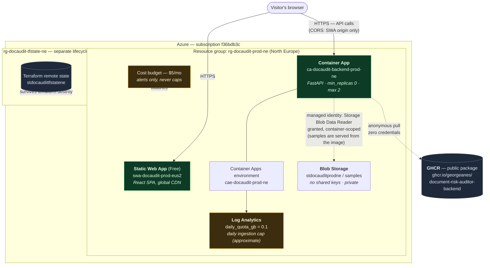

# Azure Deployment Architecture

How the Document Risk Auditor ran on Azure, and why it cost effectively
nothing at idle.

> **Status.** The public deployment was retired in September 2026. This
> document describes the topology that was deployed and that `infra/` still
> provisions.

This describes the *deployment topology*. For the application's internal
architecture — the audit pipeline, claim extraction, risk scoring — see
[architecture.md](architecture.md).

Everything below is provisioned by Terraform in [`infra/`](../infra). Nothing
was clicked into existence in the Portal.

## Topology

## Why it costs ~€0/month

| Component | Cost at idle | What keeps it there |
|---|---|---|
| Container App | **$0** | `min_replicas = 0`. No traffic, no replicas, no compute charge. |
| Static Web App | **$0** | Free SKU. |
| Blob Storage | ~$0.00 | Three markdown files, ~4 KB total. |
| Log Analytics | **$0** | Inside the 5 GB/month free ingestion grant, bounded (not exactly) by `daily_quota_gb = 0.1`. |
| Container Registry | **$0** | GHCR public package instead of Azure Container Registry (~$5/month). |
| Terraform state | ~$0.01 | One blob in a Standard LRS account. |
| Cost budget | **$0** | Budgets are free. |

**The main guardrail on log ingestion is `daily_quota_gb` on the Log
Analytics workspace.** When the daily cap is reached, ingestion stops for the
rest of the day. The cap is not exact: Azure documents that it cannot stop
collection at precisely the cap, that some excess data is expected, and that
data collected above the cap is still billed. The $5 budget only sends email;
Azure budgets never throttle, cap, or delete anything. `max_replicas = 2`
bounds compute. Scale-to-zero keeps compute near zero, but that is a
consequence of having no traffic rather than an enforced ceiling.

## The cold start, and why it is here

The backend scales to zero when idle, so **the first request after a quiet
period takes ~20s** while a container cold-starts. Subsequent requests are
under 300ms. That tradeoff is why this runs at €0/month.

This is a deliberate choice, not an oversight. The alternative —
`min_replicas = 1` — would keep a container resident around the clock and turn
a portfolio demo into a standing monthly bill, to save twenty seconds on a
first visit. For a project whose entire point is that it can sit idle
indefinitely at no cost, paying continuously to avoid a one-off wait is the
wrong trade.

Because a silent 20-second wait reads as a broken app, the frontend says what
is happening: the first slow request surfaces the explanation above rather
than a bare spinner. Measured: ~21s cold, ~0.26s warm.

## Security model

No application secrets exist in this deployment: the app needs no API key or
connection string, and the design gives it none. Two things sit outside that
statement. The Static Web Apps deployment token is a sensitive Terraform
output that the application never reads. It is stored in the Terraform state
and has to be handled with care; `tasks/todo.md` (Task 7) records that it was
printed once by mistake and rotated. And the separate Terraform-state storage
account that `scripts/bootstrap-tfstate.sh` creates still has shared-key
access enabled (the script does not disable it), although Terraform and the
operator reach it with Entra ID and the script never reads a key.

- **No registry credentials.** The GHCR package is public, so the Container
  App pulls anonymously. There is no `registry` block in the Terraform at all.
- **No storage keys on the samples account.** That account sets
  `shared_access_key_enabled = false`, so no account key or SAS token exists
  to leak. Key-based auth is refused by the platform
  (`KeyBasedAuthenticationNotPermitted`), including for Terraform itself,
  which authenticates with Entra ID.
- **One RBAC grant, narrowly scoped.** The backend's system-assigned managed
  identity holds exactly one role: `Storage Blob Data Reader`, scoped to the
  `samples` *container* rather than the storage account. Account-level scope
  would silently extend read access to any container added later. The grant is
  provisioned. The recorded checks (`tasks/todo.md`, Task 10) list it with
  `az role assignment list`, and nothing read a blob with the app's identity.
  The app does not read Blob Storage at runtime: `/samples` is served from the
  copy of `data/samples/` baked into the image, as the comment in
  `infra/storage.tf` says.
- **CORS origins are an allow-list, never a wildcard.** `FRONTEND_ORIGIN` is
  set from the Static Web App's own hostname at apply time, and the two local
  development origins are also allowed. Methods and headers are wildcards and
  credentials are allowed (`backend/app/main.py`).

### Key Vault is deliberately absent

The original design included a Key Vault. It is not deployed, because with
`LLM_MODE=off` there are **zero application secrets** to put in it — the
Gemini key is deferred, storage keys are disabled by design, and the
deployment token is a Terraform output the application never reads.

Provisioning an empty vault plus a grant to read nothing would demonstrate a
pattern without proving anything. It would also actively work against the
destroy/recreate guarantee below: Azure enforces soft-delete on every Key
Vault, so `terraform destroy` leaves the name reserved and a later recreate
fails unless purge protection is disabled — weakening a safety default to
support a resource holding nothing.

It goes in when the first real secret exists, which is the same change that
enables Gemini.

## Reproducibility

The stack was destroyed and rebuilt from scratch to prove it is genuinely
reproducible, not just deployable once:

- `terraform destroy` removed all 13 resources, leaving zero orphans in the
  resource group.
- The Terraform state backend lives in a **separate resource group created
  outside this configuration**, so it survives the destroy — visible as the
  dashed box in the diagram.
- `terraform apply` rebuilt all 13 resources, after which the full audit flow
  worked end to end again with no CORS errors.

One consequence worth knowing: **Azure assigns new random hostnames on
recreate.** Both the Container App FQDN and the Static Web App hostname
changed. Since `VITE_API_BASE_URL` is baked into the frontend bundle at build
time, a destroy/recreate is not complete until the frontend is rebuilt against
the new backend FQDN and redeployed. Re-applying alone would leave a live site
calling a hostname that no longer exists.

## Deployment sequence

Order matters in two places, both of which are load-bearing:

1. **Static Web App before the Container App** — the backend's
   `FRONTEND_ORIGIN` needs the SWA's Azure-generated hostname, which does not
   exist until the SWA resource does.
2. **Frontend build after the Container App** — `frontend/src/api.ts` reads
   `VITE_API_BASE_URL` via `import.meta.env`, which Vite resolves at *build*
   time. Building before the backend exists bakes in a placeholder.

Images are tagged with the git short SHA, never `latest`: Container Apps only
rolls a new revision when the image string textually changes, so a floating
tag would silently stop deploying after the first push.

## Regional note

Static Web Apps exists in only five regions, and North Europe is not one of
them. West Europe — the only EU option — refuses new customers on this
subscription, so the Static Web App runs in East US 2 while every other
resource is in North Europe. This has no practical effect: SWA serves content
from a global CDN edge regardless of the resource's home region, the
latency-sensitive path (API calls) still terminates in North Europe, and the
bundle is static assets with no user data.
