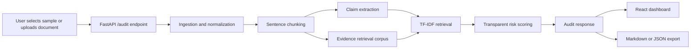

# Architecture

The application is a local-first document audit demo with a deterministic baseline. It is designed to show how enterprise AI outputs can be checked against source material before a human reviewer signs off.

## Backend

The backend exposes `GET /health`, `GET /samples`, `GET /samples/{sample_id}`, `POST /audit`, and `POST /export`.

The pipeline is intentionally modular:

- `ingest.py` validates and normalizes text, Markdown, TXT, and PDF inputs.
- `chunk.py` creates stable sentence-level document chunks.
- `claim_extraction.py` extracts factual-looking candidate claims using deterministic signals.
- `retrieval.py` ranks related passages with a local TF-IDF cosine similarity implementation.
- `risk_scoring.py` maps support and risk signals to reviewer-facing labels.
- `report_generation.py` creates the executive summary, checklist, and Markdown export.
- `llm_provider.py` contains optional environment-driven LLM configuration, but the default app does not call any LLM.

## Frontend

The frontend is a React/Vite dashboard. It keeps the workflow on one screen:

- sample selection and document input on the left
- claim findings, summary cards, and evidence review in the main panel
- export buttons for Markdown and JSON reports

The UI is intended for a recruiter or reviewer to understand the project in under a minute while still showing realistic responsible-AI workflow components.
